# TALLER 3: MICROFRAMEWORKS WEB

#### Hecho por: Daniel Santiago Gómez Zabala

En este taller, se explorará la arquitectura del microframework web llamado SparkJava. Este microframework permite construir aplicaciones web de manera simple utilizando funciones lambda. La tarea consiste en construir un servidor web que admita funcionalidades similares a las de SparkJava, como el registro de servicios GET y POST utilizando funciones lambda. Además, se deberán implementar funciones para configurar el directorio de archivos estáticos y cambiar el tipo de respuesta a "application/json". Todo esto se realizará utilizando el API básico de Java, sin utilizar frameworks como Spark o Spring. En resumen, el objetivo del taller es comprender y aplicar los conceptos detrás de un microframework web mediante la implementación de funcionalidades básicas utilizando Java.

## GETTING STARTED

1. Debe tener instalado Maven en su computador para poder ejecutar los comandos que se le indicarán más adelante.
2. Debe contar con GITHUB para poder hacer uso del repositorio donde se alberga el laboratorio.
3. Debe tener un ambiente de java para poder visualizar y ejecutar el codigo.

## INSTALLING 

Debe clonar el respositorio para poder hacer uso de la app con el comando que se encuentra a continuación

```
git clone https://github.com/sagomezab/Taller3_AREP.git
```

Para hacer uso de la aplicación debe dirigirse a la carpeta *Taller3_AREP*, ingresar a source y seguir la ruta de main, allí encontrará la clase *MyWebServices.java* para ejecutar la aplicación desde su editor de codigo ejecute la método main. (Como se indica en la imagén)

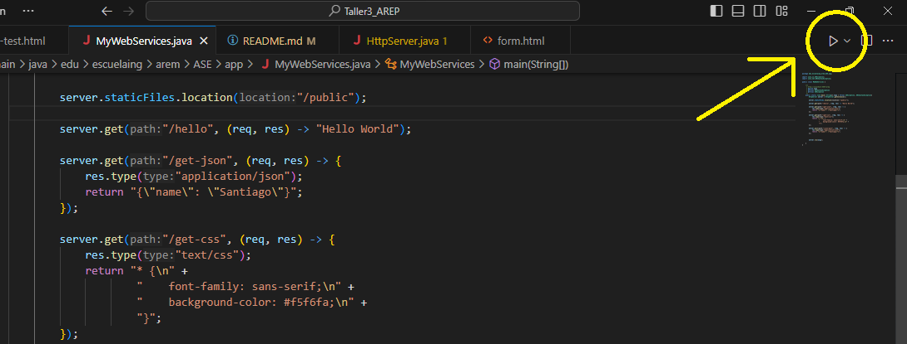


Después será necesario dirigirnos a nuestro navegador y colocar en el browser lo siguiente:

```
http://127.0.0.1:35000/
```
Se visualizará lo siguiente:

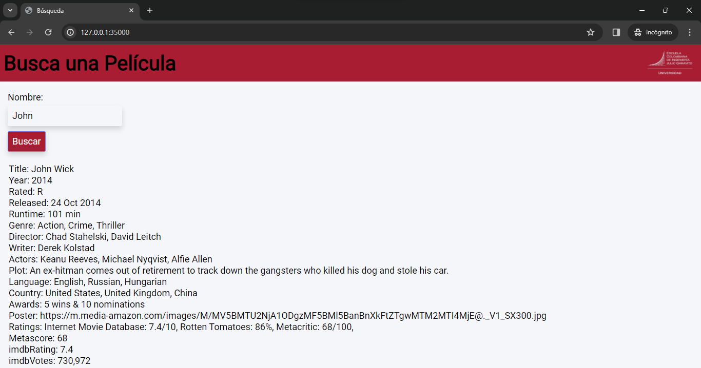

## Running The Tests

Los requerimientos del taller solicitan probar el funcionamiento del proyecto en máquinas tanto con el sistema operativo Windows como Linux. Esto implica que el proyecto debe ser probado y asegurado para funcionar correctamente en ambas plataformas.

### Windows 

1. **Static Files** 

    Para acceder a los archivos estáticos que estan quemados dentro del proyecto, solo es necesario ingresar la siguiente url:

    ```
    http://127.0.0.1:35000/404.html 
    ```
    La configuración y ubicación del archivo se encuentra dentro */main/resources/public* de la siguiente manera:

    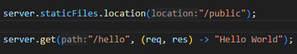

    Y se ve asi en el browser:

    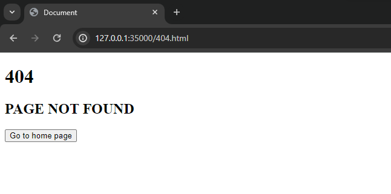

2. **GET**

    En este caso se configuro de dos recursos que entregan y se ven de la siguiente forma:

    ```
    http://127.0.0.1:35000/hello
    ```
    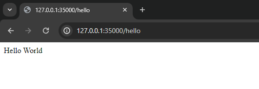
    

    ```
    http://127.0.0.1:35000/get-json
    ```
    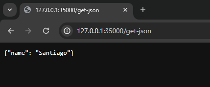
    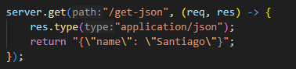

3. **POST**

    La configuración del servicio se da de la siguiente forma:
   
    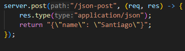
   
    Para probarlo fue necesario construir un html que hiciera referenica la post y nos entregara algo al momento de llamar el recurso:
    ```
    http://127.0.0.1:35000/post-test-html
    ```
    y se ve en el browser de la siguiente forma:
   
    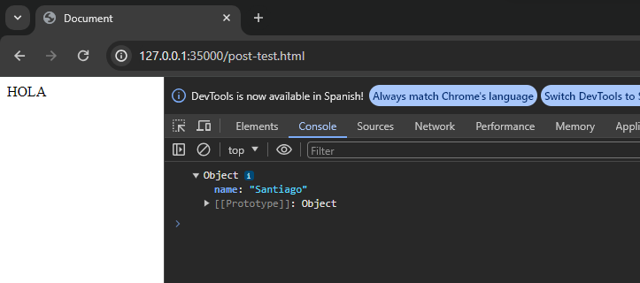

### Linux

La configuración de los recursos se realizó de manera similar tanto en Windows como en Linux. Sin embargo, en esta documentación solo se mostrarán las imágenes correspondientes a la prueba en el sistema operativo Linux.

Para ejecutar el proyecto se uso el siguiente comando dentro de la terminal de Linux:

    ```
    java -cp target/classes edu.escuelaing.arem.ASE.app.MyWebServices
    ```

Asi se ve la aplicación dentro de Linux:

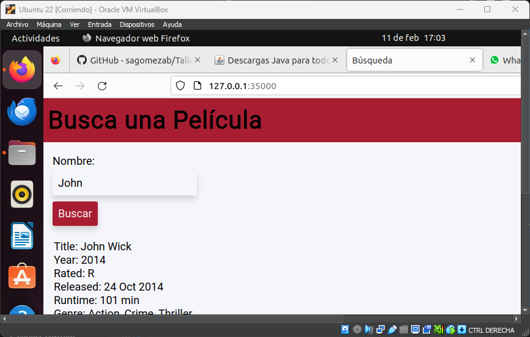

1. **Static Files** 

    ```
    http://127.0.0.1:35000/404.html 
    ```

    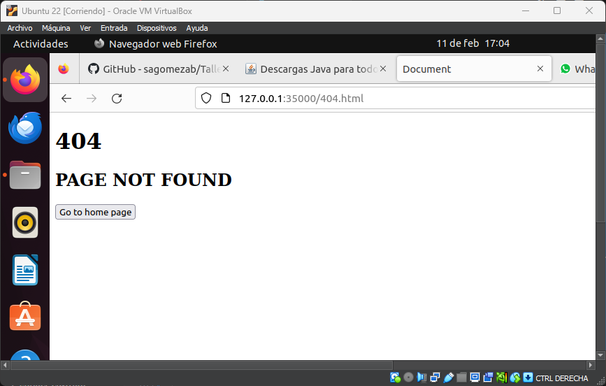

2. **GET**

    ```
    http://127.0.0.1:35000/hello
    ```
    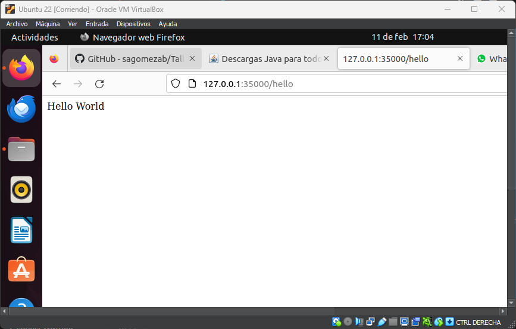

    ```
    http://127.0.0.1:35000/get-json
    ```
    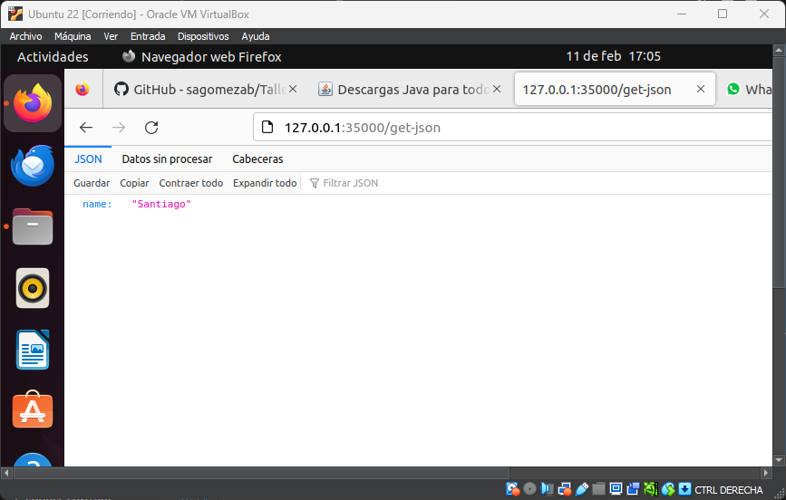

3. **POST**

    ```
    http://127.0.0.1:35000/post-test-html
    ```
    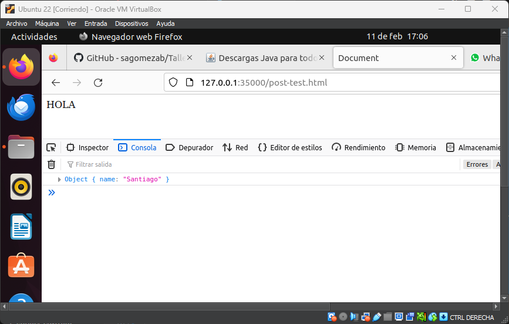

## Built With

* [Maven](https://maven.apache.org/) - Administrador de dependencias

## Version

1.2
## Author

Daniel Santiago Gómez Zabala [SAGOMEZAB](https://github.com/sagomezab)

## Acknowledgments

Patrones: El servidor web opera bajo el Patrón de Diseño Singleton, lo que significa que podemos acceder a él sin necesidad de crear una nueva instancia cada vez.

